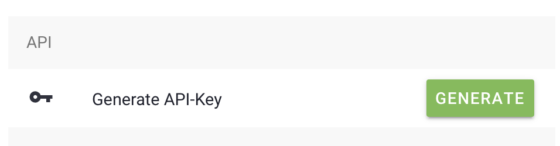
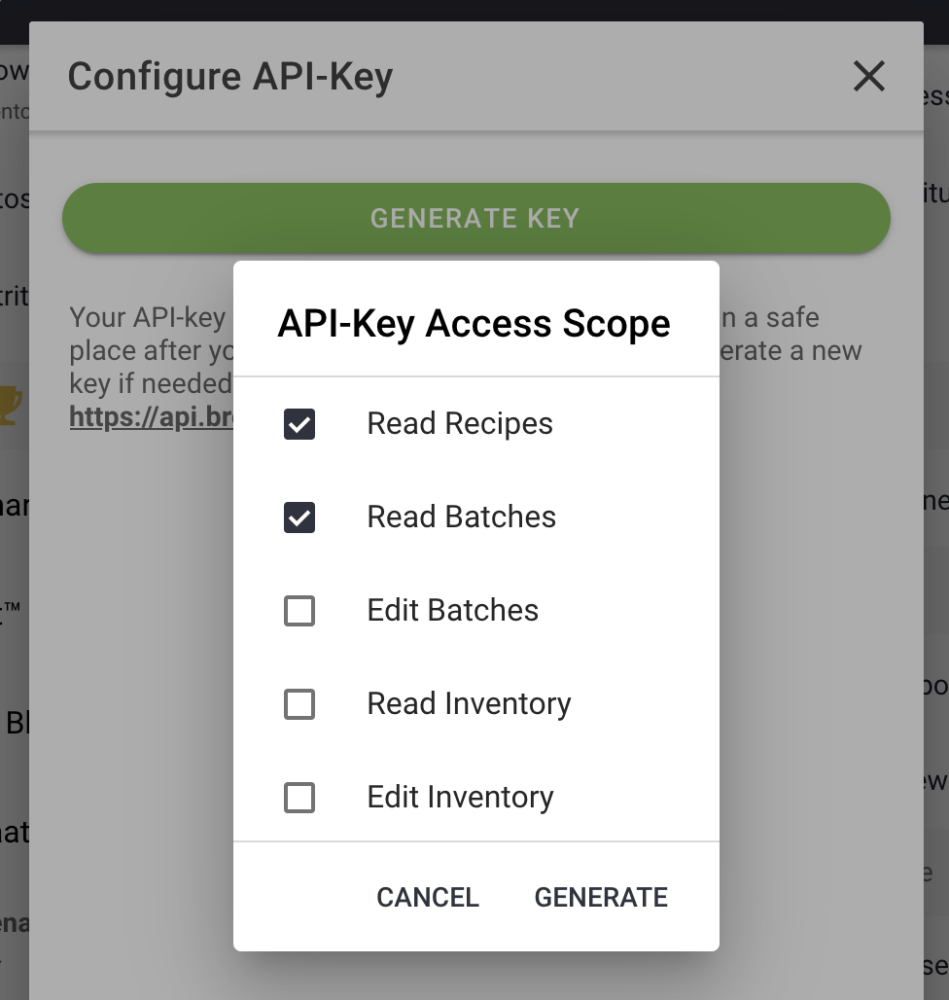
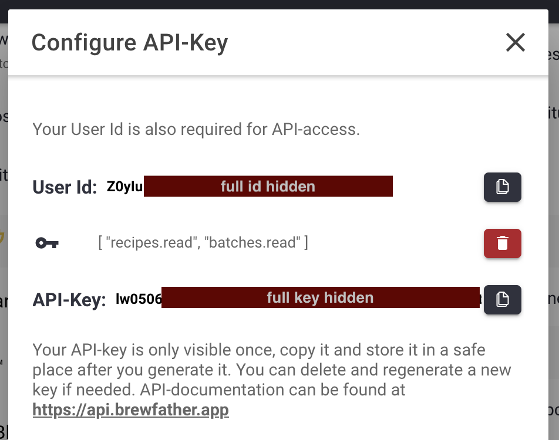
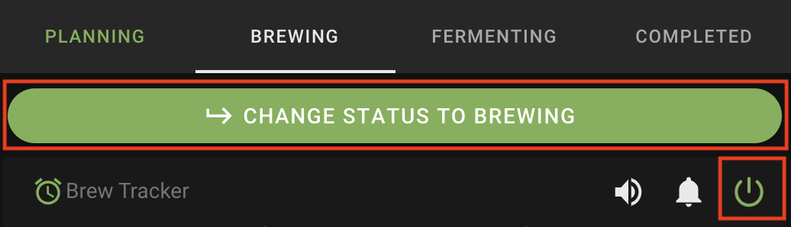

# Brewfather integration service for Brewblox

This is a preliminary implementation of integrating [Brewfather](https://brewfather.app/) together with [Brewblox](https://www.brewblox.com/).
The purpose is to have the whole brewday as simple as possible by limiting interaction from the brewer to various devices. On a brew day, you don't want to have to switch from one UI to the other as you already have a lot to think about. So the general idea is to have everything running from one interface, either Brewblox server UI or Brewfather app. For the moment, this code relies on the fact that everything is driven from Brewblox UI.
You can load recipes from Brewfather, select a recipe and start mash.
From there this module will automatically drive your mash to heat to desired mash temperature as specified in your Brewfather recipe, wait for rest time and proceed to next step, until last mash step is reached.

## Getting started

### 1. Grab API keys from Brewfather
:arrow_right: First you need to get Brewfather API credentials. This is done by going to Brewfather app > Settings and locate 'Generate API Key'


Next select the rights this key should have when hitting the server. For the moment this code only needs 'Read recipes' right. This might change in the future if we integrate more tightly with Brewfather.


Finally copy both User Id and API-key in a safe place (beware you won't be able to access API-key afterwards unless you delete this key and generate a new one)


More information can be found in [Brewfather API doc](https://docs.brewfather.app/api).

### 2. Add the brewfather service to Brewblox
Add the following entries to your `brewblox/.env` file:

```
BREWFATHER_USER_ID=changeme
BREWFATHER_TOKEN=changeme
```
and replace changeme by information you got when generating your API key

Add a new service to your brewblox setup by editing your docker-compose.yml file:

```yml
version: '3.7'
services:
  # <= Other services in your config go here
  brewfather:
    image: fdewasmes/brewblox-brewfather-service:develop
    command: '--mash-setpoint-device="SETPOINT_DEVICE" --mash-service-id=SPARK_SERVICE'
    environment:
      - BREWFATHER_USER_ID
      - BREWFATHER_TOKEN
```

Replace `SETPOINT_DEVICE` with the setpoint block id that drives your mash temperature (for instance HERMS MT Setpoint if your used the  HERMS wizard provided byt Brewblox) and `SPARK_SERVICE` with the name of the spark service your are using (for instance spark-one as suggested in getting-started documentation).

### 3. Start a mash automation
For the moment there is no widget in brewblow UI. But you can got to 

```
http://HOSTNAME/brewfather/api/doc
```

to access a swagger web page and trigger easily API calls.

you can load recipes from Brewfather by triggering load_recipes API (GET /brewfather/recipes). Here is an sample response that you can receive:

```json
[
  {
    "id": "BuBxiHOBDXru6BcYavJKrGZ9aUmQTo",
    "name": "Bryggja Tripel"
  },
  {
    "id": "neS5JJRTuV7qVnKcxWJ0GtPBu02iEw",
    "name": "CITRA IPA"
  }
]
```

However to actually start a batch we now rely on Brewfather's Brewtracker object. The reason for this is that it gathers all information from various part of the Brewfather software where user can set different options such as a reminder for warming the sparge water for instance.
In order to get started you have to initiate the batch from Brewfather by selecting a recipe and clicking on the green button representing a glass of beer. 


Once the batch is created you can list created batches by triggering an API call : get_batches (GET /brewfather/batches). You may notice that can list batches according to their current status: `Planning`, `Brewing` or `Fermenting` are all valid status to pass as a query param.
Before being able to start automation on Brewblox, you have to transition you batch to brewing state. For this you have to click on the big green button of your batch and make sure the tracker is enabled (see red square on the bottom right below)



At this point in time, the brewtracker is available. From there the Brewblox user can load the batch thanks to a 'load/{batch_id}' API endpoint that relies on brewtracker API endpoint. Swagger web UI will only you to paste your batch id and execute the HTTP call.

Once loaded you can actually start the batch by triggering another API Call: 'start_mash_automation' (GET /brewfather/startmash)
Every steps that can be automated (heat, start timer, ...) are handled and a MQTT state event is published every time the batch proceeds to a new step. 
If you want you can connect a MQTT client to follow the mash automation progress. Events are published on the `brewcast/state/brewfather` MQTT topic.
Here is a sample state object you might get: 
```json
{
    "brewtracker": {
        "active": false,
        "stages": [
            {
                "position": 300,
                "name": "Mash",
                "paused": true,
                "start": 1626329336627,
                "step": 0,
                "duration": 300,
                "type": "tracker",
                "steps": [
                    {
                        "pauseBefore": false,
                        "description": "Démarrer le tracker d'empâtage",
                        "time": 300,
                        "priority": 10,
                        "duration": 0,
                        "name": "Start",
                        "type": "mash"
                    },
                    {
                        "pauseBefore": true,
                        "name": "Mash",
                        "value": 52,
                        "type": "event",
                        "duration": 0,
                        "tooltip": "Faire chauffer à 56.6 °C",
                        "description": "Faire chauffer <b>15.15 L</b> d'eau à 56.6 °C pour l'empâtage",
                        "time": 300,
                        "priority": 10
                    }
                ]
            },
            {
                "name": "Boil",
                "position": 3600,
                "step": 0,
                "steps": [
                    {
                        "duration": 0,
                        "priority": 10,
                        "name": "Start",
                        "time": 3600,
                        "pauseBefore": false,
                        "type": "boil",
                        "description": "Démarrer le tracker d'ébullition"
                    }
                ],
                "type": "tracker",
                "duration": 3600,
                "paused": true
            },
            {
                "type": "tracker",
                "step": 0,
                "duration": 1200,
                "steps": [
                    {
                        "description": "Démarrer le Hop Stand @ 80 °C",
                        "pauseBefore": true,
                        "time": 1200,
                        "value": 0,
                        "name": "Hop Stand",
                        "priority": 10,
                        "type": "hopstand",
                        "duration": 0
                    },
                    {
                        "description": "<b>Ajout hopstand pour 20 min:</b></br> <i><b>34 g</b> Citra</i>",
                        "pauseBefore": false,
                        "time": 1200,
                        "type": "event",
                        "priority": 0,
                        "tooltip": "Ajout hopstand pour 20 min"
                    },
                    {
                        "description": "Fin du houblonnage Hors Flamme",
                        "pauseBefore": true,
                        "duration": 0,
                        "time": 0,
                        "priority": 10,
                        "final": true,
                        "name": "Hop Stand",
                        "type": "event",
                        "value": 0
                    }
                ],
                "position": 1200,
                "name": "Hop Stand",
                "paused": true
            }
        ],
        "alarm": true,
        "hidden": false,
        "enabled": true,
        "notify": true,
        "_rev": "KTZwrhUEzUUo1UCqTSZGBOFm0W9Lvz",
        "completed": false,
        "stage": 0,
        "_id": "XXXX",
        "name": "Brassin #8"
    },
    "stage_index": 0,
    "batch_id": "XXXX",
    "timer": null,
    "automation_stage": "MASH",
    "recipe_id": "",
    "automation_state": "STANDBY",
    "recipe_name": "TEST RECIPE CITRA",
    "step": {
        "value": 0,
        "description": "Empâtage terminé",
        "type": "event",
        "pauseBefore": true,
        "tooltip": null,
        "name": "Mash",
        "duration": 0
    },
    "step_index": 11,
    "mash_start_time": "2021-07-15T06:52:05.580774"
}
```

In case there is a step that requires manual operation, the state is STANDBY and brewer can proceed by calling the '/proceed' API endpoint (GET /brewfather/proceed).
Every steps that can be automated (heat, start timer, ...) are handled and a MQTT state event is published every time the batch proceeds to a new step. In case there is a step that requires manual operation, the state is STANDBY and brewer can proceed by calling the '/proceed' API endpoint (GET /brewfather/proceed).

*Design decisions worth knowing:*

If Brewtracker states that no pause is needed for a step, we proceed automatically to the next step. This is the case for the first mash step for instance:

```json
{
    "pauseBefore": false,
    "description": "Démarrer le tracker d'empâtage",
    "time": 300,
    "priority": 10,
    "duration": 0,
    "name": "Start",
    "type": "mash"
}
```
The opposite is also true, is `pauseBefore`is set to `true` it is for the brewer to take manual action. In this case, the mash is in `STANDBY`state. Otherwise it can be in `HEAT` state if we are waiting to reach a new target temperature or `REST` if we reached temperature and need to rest for a certain time at this temperature.

If anything goes wrong with the service and it restarts, it will automatically check if a timer needs to be restored. 

**IMPORTANT:**
In case it appears a timer should be restored because the mash is in `REST` state, if the timer was supposed to end in the past, the automation will proceed automatically to the next step. If the state is `REST` but there is no timer available in the state object, an exception is raised and nothing happens until the `proceed` endpoint is manually called.
                   

